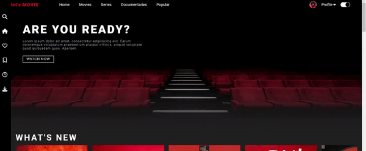
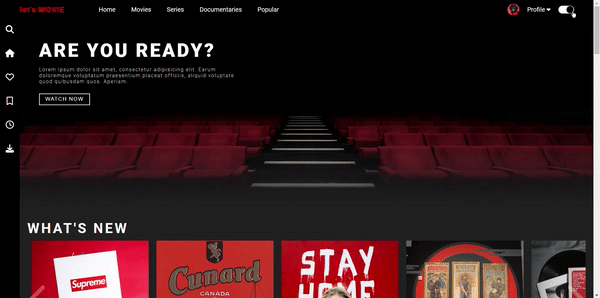

# Movie site :film_projector: :clapper: | [LIVE DEMO](https://rusdiana97.github.io/lets-movie.github.io/)

## 1. Project Description

The current project is a movie site. It is made with HTML, CSS and Javascript in Visual Studio Code. 
Also, this is a personal project.

The project offers the following functionalities: 
- responsive web design 
- single page
- animations 
- transitions 
- navigation bar with menu
- fixed sidebar
- sliders for movies
- toggle for dark / light theme

## 2. How to Install / Run the Project

In this case, you have two choices:
1. download the entire project on your computer from Code -> Download Zip and open the index.html file on your browser for running the project
2. click on [LIVE DEMO](rusdiana97.github.io/lets-movie.github.io/) for running the project on your browser (you won't download the project)

**I recommend you to see the [LIVE DEMO](rusdiana97.github.io/lets-movie.github.io/) of the project.**

## 3. How to Use the Project

Next you can see a series of screenshots and gifs of the website to get an idea.

When you will open the site, you will see this:

You can see the logo of the site, the navigation bar, the sidebar and some animations and transitions for grabbing the attention of the user.

You can use the toggle for switching to the light theme:

Navigate on the site with the help of the navigation bar positioned on the top and with the help of the fixed sidebar:

Do you want to see what's popular on the site? Just click on the Popular!

Or you can just scroll on the page and used the slider to see what's popular:

See more on [LIVE DEMO](rusdiana97.github.io/lets-movie.github.io/)!

## 4. Credits

 - [Images](https://unsplash.com)
 - [Icons](https://fontawesome.com)
 - [Fonts](https://fonts.google.com)
